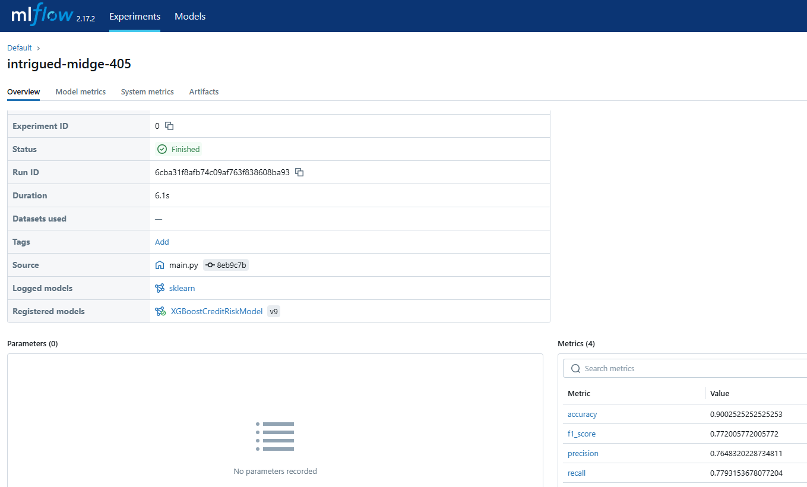

# <h1 align="center">🏦 RiskEngine AI: Production-Ready Credit Underwriting Pipeline</h1>

<p align="center">
  <a href="https://www.python.org/downloads/">
  <a href="https://mlflow.org/"></a>
  <a href="https://www.docker.com/"></a>
  <a href="https://render.com"></a>
</p>

---

## ⚡ Executive Summary & Overview

**RiskEngine AI** is an enterprise-grade, configuration-driven Machine Learning Operations (**MLOps**) production pipeline engineered to evaluate consumer credit risk and compute default probabilities. Powered by a high-performance **XGBoost** classification engine, this framework shifts machine learning away from isolated Jupyter notebooks into a resilient, **deployable, modular, and type-safe architecture**.

By processing multi-dimensional financial features—such as borrower age, historical income dynamics, loan structures, and historical credit-line lengths—the pipeline serves real-time credit decisioning via a high-throughput web application dashboard.

---

## 🚀 Live Production Deployment

The entire inference application layer and frontend decisioning interface are fully containerized via **Docker** and actively orchestrating live workloads on **Render**.

- **🔗 Production Gateway:** [Access the Underwriting Dashboard Here](https://credit-risk-mlops-pipeline-ign4.onrender.com)
- 💡 _Note: Infrastructure hosted on Render's standard tier may experience a brief 30–60 second cold-start latency during initial routing container spin-up._

---

## 🧠 Core Engineering Architecture & MLOps Capabilities

This system was meticulously architected from the ground up to mirror **production-grade enterprise MLOps patterns**, emphasizing clean **separation of concerns**, strict **data governance**, and extreme resilience against **data drift** and pipeline degradation.


### 🚀 Key Technical Pillars

* **Configuration-Driven Architecture & Decoupling:** Complete elimination of hardcoded operational parameters. Every data ingestion endpoint, validation rule, train-test splitting ratio, and model hyperparameter (e.g., `scale_pos_weight`) is dynamically declared inside centralized `config.yaml` and `params.yaml` layers. This abstracts **execution logic away from the raw data infrastructure**, allowing seamless structural modifications with **zero code refactoring**.

* **Strict Type Safety & Schema Enforcement Contracts:** Implements runtime programmatic constraints using Python `@dataclass(frozen=True)` **Data Transfer Objects (DTOs)** coupled with strict `@ensure_annotations` verification. By validating incoming data matrices against an immutable `schema.yaml` definition, the system acts as a rigid **structural gatekeeper**—instantly halting execution upon detecting unexpected features or data type mutations, effectively neutralizing **data corruption vectors** before **model poisoning** can occur.

* **Two-Tier Data Quality Governance (Validation vs. Adaptive Healing):** Designed a sophisticated decoupling between data monitoring and pre-processing. The **Data Validation** stage isolates structural anomalies (missing or corrupted columns) as fatal pipeline exceptions. Conversely, the **Data Transformation** stage serves as an **adaptive healing layer**—automatically handling statistical anomalies, dynamically imputing missing numerical/categorical values via customized **Scikit-Learn Pipelines**, and programmatically filtering out biological outliers (e.g., `age > 100`).

* **Unbreakable Feature Lineage & Explicit Data Contracts:** Successfully mitigated the systemic industry challenge where Scikit-Learn matrix transformations silently strip Pandas metadata and shuffle index positions during **One-Hot Encoding** and scaling. By engineering an explicit naming contract using `get_feature_names_out()`, the pipeline guarantees that the downstream **XGBoost Classifier** trains on mathematically accurate, **labeled feature matrices** rather than implicit array slices (`[:, :-1]`), entirely eliminating **silent alignment drift**.

* **Enterprise Experiment Governance via MLflow:** Engineered built-in, production-ready experiment tracking to continuously stream pipeline run state metrics (**Accuracy**, **Precision**, **Recall**, **F1-Score**), operational hyperparameters, and serialized binaries directly into the **MLflow Tracking Server** and centralized **Model Registry**. The codebase features an **adaptive networking schema**, capable of gracefully transitioning between localized file-based tracking (`mlruns`) and active remote server environments via native **URI parsing**.

* **Resilient Remote Ingestion & Artifact Lifecycle Management:** Built a fault-tolerant automated data ingestion module tailored to manage remote network exceptions and binary zip lifecycles. Designed to handle real-world edge cases (such as parsing raw binary data blocks vs. GitHub UI HTML layers), the module programmatically ensures automated **data provenance**, extracts compressed multi-column CSVs, and maps **dynamic file paths** to downstream tracking dependencies without manual human intervention.

* **Modular Orchestration & Automated CI/CD Workflows:** Structured using clean, production-ready **Object-Oriented Programming (OOP)** patterns where distinct steps are isolated into individual components and orchestrated seamlessly by a singular `main.py` entry point. The entire repository is tightly integrated with a **GitHub Actions** automation suite; every codebase mutation triggers automated remote runners to enforce syntax validation, evaluate dependencies, and construct isolated test **Docker** container builds for **continuous deployment**.

---

## ⚙️ Pipeline & Project Architecture

### 📊 System Execution Architecture

The underlying data and training flow operates through five fully decoupled, autonomous components:

```text
🏁 Pipeline Ingestion Trigger
       │
       ▼
 📦 [01_Data_Ingestion]      ──► Fetches remote zipped payloads & extracts 'credit_risk.csv'
       │
       ▼
 🛡️ [02_Data_Validation]     ──► Validates structure against strict schema.yaml constraints
       │
       ▼
 🔄 [03_Data_Transformation] ──► Orchestrates train-test splits & handles numerical vectors
       │
       ▼
 🚀 [04_Model_Trainer]        ──► Ingests parameters, runs XGBoost, and serializes weights
       │
       ▼
 📈 [05_Model_Evaluation]     ──► Quantifies classification metrics & streams telemetry to MLflow
```
---

### MlFlow Snapshot


### 🛡️ Enterprise Data Governance & Quality Assurance

* **Multi-Stage Data Validation Engine:** Upgraded the pipeline from basic structural column checks to an active validation layer enforcing null-value constraints and strict logical domain boundaries (e.g., isolating impossible financial records and out-of-bounds demographic ranges before downstream training runs).
* **Automated Quality Gateways (CI/CD Integration):** Implemented a rigorous test suite using `pytest` to mechanically verify data integrity, partition split balances, and target binary classification constraints (`0` or `1` enforcement).
* **Defensive Deployment Strategy:** Programmed automated unit tests directly into the **GitHub Actions workflow**. The CI/CD engine acts as a production gatekeeper—instantly blocking broken container builds from deploying to the cloud if a data mutation or structural failure is detected.

---

## 🗂️ Complete Directory Topology

```text
credit-risk-mlops-pipeline/
├── .github/
│   └── workflows/
│       └── ci-cd.yaml         # GitHub Actions Workflow Engine
├── artifacts/                  # Local Pipeline Versioned Storage
│   ├── data_ingestion/        # Extracted credit_risk.csv source layer
│   ├── data_validation/       # Schema evaluation compliance outputs
│   ├── data_transformation/   # Prepared Model-Ready Partitions (train/test)
│   ├── model_trainer/         # Serialized model.joblib binaries
│   └── model_evaluation/      # Local telemetry outputs (metrics.json)
├── config/
│   └── config.yaml            # Monolithic Pipeline Component Registry
├── src/
│   └── mlProject/
│       ├── components/        # Isolated Functional Execution Tasks
│       ├── config/            # Internal Configuration Management Engines
│       ├── entity/            # Strongly-Typed In-Memory Data Models
│       ├── pipeline/          # Orchestrated Sequential Stage Controllers
│       └── utils/             # High-Performance Common Core Utilities
├── static/                    # Frontend UI Presentation Assets
├── templates/                 # UI Execution Views (index.html, results.html)
├── tests/                     # Automated MLOps Quality Testing Framework
│   ├── __init__.py            # Explicit namespace initializer for test discovery
│   └── test_pipeline.py       # Core structural validation, split balance, and label sanity unit tests
├── Dockerfile                 # Multi-Stage App Deployment Container Specs
├── params.yaml                # XGBoost Model Hyperparameter Definitions
├── schema.yaml                # Core Data Validation Schema Declarations
├── requirements.txt           # Monitored Project Component Dependencies
└── wsgi.py                    # High-Performance Application Gateway
```

---

## 🛠️ Condensed Workflow Progression

### 1. Declarative Updates

Configure asset paths in `config.yaml`, tune XGBoost hyperparameters in `params.yaml`, and define columns in `schema.yaml`.

### 2. Contract Construction

Instantiate type-safe operational variables inside the internal `config_entity.py` domain.

### 3. Component Engineering

Program the core pipeline steps inside the isolated `components` catalog.

### 4. Execution Orchestration

Link execution blocks into isolated pipeline stages routed through `main.py`.

### 5. UI & API Integration

Bind predictive workflows to web endpoints within the service runner (`wsgi.py`).

### 6. Containerization & Deployment

Package the runtime dependencies via Docker and deploy to Render.

---

## 📈 Single-Line Operational Project Flow

```text
Data Ingestion ──► Structural Validation ──► Feature Transformation ──► XGBoost Optimization ──► MLflow Registration ──► API Inference Serving
```

---

## 🧩 Unified Enterprise Tech Stack

| Operational Domain      | Applied Technologies                              |
| ----------------------- | ------------------------------------------------- |
| Core Programming Engine | Python 3.10+                                      |
| Model Optimization      | XGBoost (Extreme Gradient Boosting Classifier)    |
| Data Orchestration      | Pandas, NumPy, Scikit-Learn, Joblib               |
| Experiment Governance   | MLflow Tracking Server & Model Registry           |
| Inference Framework     | Flask / FastAPI High-Performance Web Services     |
| Runtime Environment     | Anaconda / Miniconda Package Ecosystem            |
| Infrastructure & DevOps | Docker Engine, GitHub Actions CI/CD, Render Cloud |

---

## 💻 Local Setup & Development Environment

### Step 1: Environment Provisioning

```bash
conda create -n mlproj python=3.10 -y
conda activate mlproj
```

### Step 2: Dependency Synchronization

```bash
pip install -r requirements.txt
```

### Step 3: Launch Local Core Pipeline & Web Server

```bash
python main.py   # Runs entire End-to-End MLOps Pipeline
python wsgi.py   # Launches local development inference web interface
```
### Step 4: Execute Automated MLOps & Data Contracts Tests
To programmatically verify data ingestion schemas, transformation splitting integrity, and target column boundary conditions locally before committing changes, execute the test suite using pytest:

```bash
# Run all data and pipeline unit tests with verbose logging
pytest -v tests/test_pipeline.py
```

---


## 🧾 License & Personal Dedication

This project is licensed under the MIT License—granting full authorization for modifications, business distribution, and private adaptation.

### A Note from the Author

This system serves as a showcase of modern MLOps principles, blending modern machine learning engineering with software craftsmanship.

If this repository helped you scale your production deployment mental models, feel free to give it a ⭐!